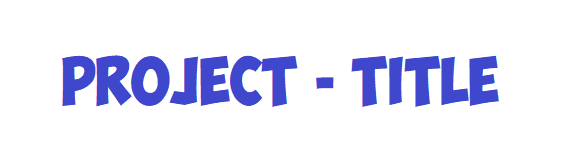

  

<h1 align="center">
  Title
</h1>

  
  
  
  
  
  
  
   
  
  
  
  
   
  

  <a href="https://github.com/ik-web">
    [> DEMO LINK <]
  </a> 

## Description:

Description text here

## Documentation

**The npm commands used to install the required node modules:**
- `npm`

## Developers

- [Ihor Kuchin](https://github.com/ik-web)

## License

>MIT License
>
>Copyright (c) 2022 Ihor Kuchin
>
>Permission is hereby granted, free of charge, to any person obtaining a copy
>of this software and associated documentation files (the "Software"), to deal
>in the Software without restriction, including without limitation the rights
>to use, copy, modify, merge, publish, distribute, sublicense, and/or sell
>copies of the Software, and to permit persons to whom the Software is
>furnished to do so, subject to the following conditions:
>
>The above copyright notice and this permission notice shall be included in all
>copies or substantial portions of the Software.
